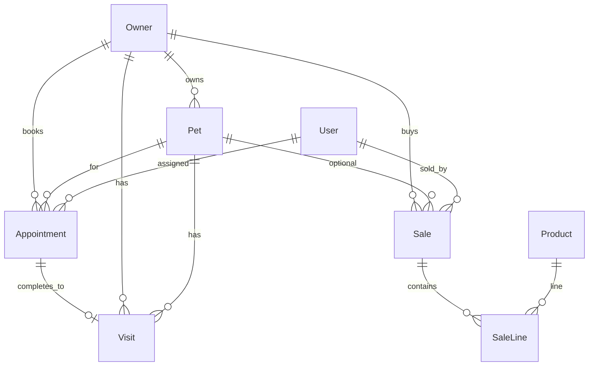

# Pet Shop Ops — Product Requirements Document

## 1. Overview

**Pet Shop Ops** is an internal staff web application for a pet shop that combines consultation booking, owner/pet record keeping, and retail sales of pet supplies.

Staff use one system to:

- Book and complete consultations (with visit history)
- Maintain owner and pet profiles with a unified timeline
- Sell supplies and retain who bought what

The product is staff-facing only. Customers do not log in or self-book in this MVP.

---

## 2. Goals and non-goals

### Goals (MVP)

- Schedule consultations and record completed visit notes, treatments, and follow-ups
- Keep searchable historical records for owners and pets
- Sell pet supplies with stock tracking and purchase history linked to owners (and optionally pets)
- Give staff a simple dashboard for today’s appointments and recent activity
- Restrict admin-only functions (staff user management) by role

### Non-goals (v1)

- Customer self-booking portal or customer accounts
- Online payment gateway / card processing integration
- Supplier purchasing, purchase orders, or full inventory receiving
- Multi-branch / multi-location support
- SMS or email appointment reminders
- Full veterinary EMR (lab results, prescriptions, imaging)

---

## 3. Users and roles

| Role | Who | Capabilities |
|------|-----|--------------|
| `STAFF` | Front desk / shop floor | Day-to-day ops: owners, pets, appointments, products, sales, dashboard |
| `ADMIN` | Shop manager / owner | Everything `STAFF` can do, plus staff user CRUD (`/staff`) |

Authentication is email + password. Sessions use JWT. Unauthenticated users are sent to login.

---

## 4. Core entities

| Entity | Purpose |
|--------|---------|
| **Owner** | Customer contact (name, phone, email, address, notes) |
| **Pet** | Animal linked to an owner (species, breed, sex, DOB, weight, allergies, microchip, notes); soft-archived via `archivedAt` |
| **Appointment** | Scheduled consultation for an owner + pet (time, type, reason, status, optional assigned staff) |
| **Visit** | Historical clinical/service record created when an appointment is completed (notes, treatments summary, follow-up date) |
| **Product** | Sellable supply (name, SKU, price, stock qty, active flag) |
| **Sale** / **SaleLine** | Purchase record: buyer (owner or walk-in name), optional pet, payment method, lines, total, cashier; can be voided |
| **User** | Staff account with role `ADMIN` or `STAFF` |

### Appointment types

`CHECKUP` | `VACCINE` | `GROOMING` | `OTHER`

### Appointment statuses

`SCHEDULED` | `COMPLETED` | `CANCELLED` | `NO_SHOW`

### Payment methods

`CASH` | `CARD` | `OTHER`

### Sale statuses

`COMPLETED` | `VOIDED`

---

## 5. Functional requirements

### 5.1 Consultations (booking + history)

| ID | Requirement |
|----|-------------|
| C1 | Staff can create an appointment for an owner and pet with start time, type, optional reason, and optional assigned staff |
| C2 | Staff can list/filter appointments by date range and status |
| C3 | Staff can update appointment details and status (`CANCELLED`, `NO_SHOW`, etc.), except completion which uses the dedicated complete flow |
| C4 | Completing an appointment creates a **Visit** (notes required; optional treatments summary and follow-up date) and sets appointment status to `COMPLETED` |
| C5 | Completed visits appear on the owner and pet timelines |
| C6 | Follow-up dates on visits are stored for later use (dashboard follow-up surfacing may be enhanced later) |

### 5.2 Pet and owner historical records

| ID | Requirement |
|----|-------------|
| R1 | Staff can create and update owners (name required; phone, email, address, notes optional) |
| R2 | Staff can search owners by name/phone |
| R3 | Staff can create and update pets linked to an owner |
| R4 | Staff can search pets; archived pets are hidden by default and includable via flag |
| R5 | Staff can soft-archive a pet (retain history; do not hard-delete) |
| R6 | Owner detail shows a timeline of visits and sales for that owner |
| R7 | Pet detail shows a timeline of visits and sales for that pet |

### 5.3 Pet supplies sales + purchase history

| ID | Requirement |
|----|-------------|
| S1 | Staff can manage products: name, unique SKU, price, stock quantity, active flag |
| S2 | Staff can search products and filter to active-only |
| S3 | Staff can create a sale with one or more lines (product, quantity, unit price) |
| S4 | Sale must identify a buyer: linked **Owner** and/or **walk-in name**; optional **Pet** |
| S5 | Creating a sale decrements product stock; insufficient stock is rejected |
| S6 | Staff can void a completed sale; void restores stock and sets status to `VOIDED` |
| S7 | Sales appear on owner/pet timelines when linked; recent sales appear on the dashboard |
| S8 | Sale records who sold it (`soldByUserId`) and payment method |

### 5.4 Dashboard and staff admin

| ID | Requirement |
|----|-------------|
| D1 | Dashboard shows today’s scheduled appointment count, owner count, active pet count, and recent sales |
| D2 | Admins can list, create, update, and delete staff users |
| D3 | Staff role cannot access staff user management |

---

## 6. Screens

| Route | Screen | Purpose |
|-------|--------|---------|
| `/login` | Login | Email/password authentication |
| `/` | Dashboard | Today’s appointments count, totals, recent sales |
| `/owners` | Owners list | Search and open owners |
| `/owners/[id]` | Owner detail | Profile + timeline |
| `/pets` | Pets list | Search and open pets |
| `/pets/[id]` | Pet detail | Profile + timeline |
| `/appointments` | Appointments | Schedule, filter, update, complete → visit notes |
| `/products` | Products list | Catalog and stock |
| `/products/[id]` | Product detail | View/edit product |
| `/sales` | Sales / POS | Create sales, list/void |
| `/staff` | Staff admin | User CRUD (`ADMIN` only) |

Navigation labels: Dashboard, Owners, Pets, Appointments, Products, Sales, Staff (admin only). Brand: **Pet Shop Ops** — “Consultations · Records · Sales”.

---

## 7. Acceptance criteria

### Consultations

- [ ] Staff can book an appointment for a specific owner and pet
- [ ] Appointments can be filtered by date range and status
- [ ] Completing an appointment requires visit notes and creates a Visit
- [ ] Completed visit appears on both owner and pet timelines
- [ ] Appointment status becomes `COMPLETED` after complete; cancelled/no-show paths do not create visits

### Records

- [ ] Owner and pet can be created, edited, and searched from the UI
- [ ] Archiving a pet hides it from default lists but preserves appointments, visits, and sales history
- [ ] Opening an owner or pet shows a chronological timeline of visits and sales

### Sales

- [ ] Staff can sell one or more products in a single sale linked to an owner (or walk-in)
- [ ] Stock decreases on sale and restores on void
- [ ] Sale history is visible on the sales page and on the linked owner/pet timeline
- [ ] Walk-in sales without an owner still record a name and remain listable

### Access

- [ ] Unauthenticated users cannot access ops screens
- [ ] Only `ADMIN` can manage staff users
- [ ] `STAFF` can perform day-to-day consultations, records, and sales

---

## 8. Out of scope / later

- Appointment reminders (SMS/email)
- Structured vaccine registry (beyond appointment type + free-text notes)
- Low-stock alerts and reorder suggestions on the dashboard
- Customer-facing booking portal
- Payment gateway integration
- Multi-location / multi-branch
- Supplier and purchase-order workflows
- Receipt printing / PDF export
`)