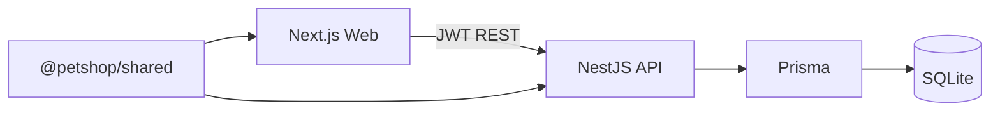

# Pet Shop Ops — Tech Stack

## 1. Architecture

Pet Shop Ops is a **pnpm monorepo** with three packages:

| Package | Path | Role |
|---------|------|------|
| API | `packages/api` | NestJS REST API + Prisma |
| Web | `packages/web` | Next.js App Router staff UI |
| Shared | `packages/shared` | `@petshop/shared` — enums, Zod schemas, shared types |

The web app calls the API over HTTP with a Bearer JWT. Shared validation schemas and enums keep client and server aligned.

---

## 2. Stack versions

Versions recovered from the project’s install artifacts (`node_modules` / pnpm store):

| Layer | Choice | Version |
|-------|--------|---------|
| Package manager | pnpm workspace | — |
| Runtime | Node.js | 22.x types (`@types/node@22.20.1`) |
| API framework | NestJS (`@nestjs/core`, `common`, `platform-express`) | **10.4.22** |
| API config | `@nestjs/config` | **3.3.0** |
| Auth | `@nestjs/jwt` 10.2.0, `@nestjs/passport` 10.0.3, `passport` 0.7.0, `passport-jwt` 4.0.1 | — |
| Password hashing | `bcryptjs` | **2.4.3** |
| API validation | `class-validator` 0.14.4, `class-transformer` 0.5.1 | — |
| ORM | Prisma + `@prisma/client` | **6.19.3** |
| Database | SQLite (file via `DATABASE_URL`) | — |
| Web framework | Next.js | **15.5.22** |
| UI library | React / React DOM | **19.2.8** |
| Styling | Tailwind CSS 3.4.19, PostCSS 8.5.24, Autoprefixer 10.5.4 | — |
| Shared validation | Zod | **3.25.76** |
| Language | TypeScript | **5.9.3** (also 5.7.2 present for Nest schematics) |
| Reactive | `rxjs` 7.8.2, `reflect-metadata` 0.2.2 | — |

---

## 3. Package responsibilities

### `packages/api`

- NestJS modules: `auth`, `users`, `owners`, `pets`, `appointments`, `products`, `sales`, `dashboard`, `timeline`, `prisma`
- Global `ValidationPipe` (whitelist + forbid non-whitelisted)
- Global `JwtAuthGuard` + `RolesGuard`
- CORS enabled (`origin: true`)
- Default listen port **3001**
- Prisma schema and SQLite DB under `packages/api/prisma/`

### `packages/web`

- Next.js App Router under `src/app/`
- Staff UI routes: login, dashboard, owners, pets, appointments, products, sales, staff
- Client auth context; token keys in `localStorage`: `petshop_token`, `petshop_user`
- Tailwind branding (`brand-*`, `font-display`, cards)
- Calls API via `NEXT_PUBLIC_API_URL` (fallback `http://localhost:3001`)

### `packages/shared` (`@petshop/shared`)

- Enums: `UserRole`, `AppointmentType`, `AppointmentStatus`, `PaymentMethod`, `SaleStatus`, `PetSex`
- Zod schemas: `loginSchema`, `ownerSchema`, `petSchema`
- Types: `JwtPayload`, `TimelineItem` / `TimelineItemType` (`visit` | `sale`)
- Helpers: `hasMinimumRole()`

---

## 4. Auth model

| Item | Detail |
|------|--------|
| Login | `POST /auth/login` (public) — email + password |
| Current user | `GET /auth/me` (authenticated) |
| Token | JWT Bearer in `Authorization` header |
| Password | bcrypt hash stored on `User.passwordHash` |
| Roles | `ADMIN` \| `STAFF` |
| Guards | Global JWT auth; `@Roles('ADMIN')` on users controller |
| Client storage | `localStorage` keys `petshop_token`, `petshop_user` |

Unauthenticated web users are redirected to `/login`.

---

## 5. API surface

All routes except login require JWT.

| Module | Method | Path | Notes |
|--------|--------|------|-------|
| **auth** | `POST` | `/auth/login` | Public |
| | `GET` | `/auth/me` | Current user |
| **users** | `GET` | `/users` | `ADMIN` |
| | `POST` | `/users` | `ADMIN` |
| | `PATCH` | `/users/:id` | `ADMIN` |
| | `DELETE` | `/users/:id` | `ADMIN` |
| **owners** | `GET` | `/owners?q=` | Search |
| | `GET` | `/owners/:id` | Detail |
| | `GET` | `/owners/:id/timeline` | Visits + sales |
| | `POST` | `/owners` | Create |
| | `PATCH` | `/owners/:id` | Update |
| **pets** | `GET` | `/pets?q=&includeArchived=` | Search |
| | `GET` | `/pets/:id` | Detail |
| | `GET` | `/pets/:id/timeline` | Visits + sales |
| | `POST` | `/pets` | Create |
| | `PATCH` | `/pets/:id` | Update |
| | `POST` | `/pets/:id/archive` | Soft-archive |
| **appointments** | `GET` | `/appointments?from=&to=&status=` | List/filter |
| | `GET` | `/appointments/:id` | Detail |
| | `POST` | `/appointments` | Create |
| | `PATCH` | `/appointments/:id` | Update |
| | `POST` | `/appointments/:id/complete` | Creates Visit + marks COMPLETED |
| **products** | `GET` | `/products?q=&activeOnly=` | List |
| | `GET` | `/products/:id` | Detail |
| | `POST` | `/products` | Create |
| | `PATCH` | `/products/:id` | Update |
| **sales** | `GET` | `/sales?limit=` | List |
| | `GET` | `/sales/:id` | Detail |
| | `POST` | `/sales` | Create (decrements stock) |
| | `POST` | `/sales/:id/void` | Void (restores stock) |
| **dashboard** | `GET` | `/dashboard` | Today’s counts + recent sales |

**Visits** have no standalone controller. They are created inside `POST /appointments/:id/complete` and surfaced via owner/pet timelines.

**Timeline** is an internal service used by owners/pets endpoints (no dedicated public controller).

---

## 6. Data model

### Enums

- `UserRole`: `ADMIN`, `STAFF`
- `AppointmentType`: `CHECKUP`, `VACCINE`, `GROOMING`, `OTHER`
- `AppointmentStatus`: `SCHEDULED`, `COMPLETED`, `CANCELLED`, `NO_SHOW`
- `PaymentMethod`: `CASH`, `CARD`, `OTHER`
- `SaleStatus`: `COMPLETED`, `VOIDED`
- `PetSex`: `MALE`, `FEMALE`, `UNKNOWN`

### Models (summary)

| Model | Key fields | Relations |
|-------|------------|-----------|
| **User** | email, passwordHash, name, role | assignedAppointments, sales |
| **Owner** | name, phone, email, address, notes | pets, appointments, visits, sales |
| **Pet** | ownerId, name, species, breed, sex, dateOfBirth, weight, allergies, microchipId, notes, archivedAt | owner, appointments, visits, sales |
| **Appointment** | ownerId, petId, assignedUserId?, startsAt, type, reason, status | owner, pet, assignedUser, visit? |
| **Visit** | appointmentId (unique), ownerId, petId, notes, treatmentsSummary?, followUpAt?, occurredAt | appointment, owner, pet |
| **Product** | name, sku (unique), price, stockQty, active | saleLines |
| **Sale** | ownerId?, walkInName?, petId?, paymentMethod, total, status, soldByUserId, occurredAt | owner, pet, soldBy, lines |
| **SaleLine** | saleId, productId, quantity, unitPrice | sale, product |

Owner is the hub: pets, appointments/visits, and sales hang off the owner (and usually a pet).

---

## 7. Runtime configuration

| Variable | Where | Purpose |
|----------|-------|---------|
| `DATABASE_URL` | root / API `.env` | Prisma SQLite connection string |
| `PORT` | root / API `.env` | API port (default **3001**) |
| `JWT_SECRET` | root / API `.env` | JWT signing secret |
| `JWT_EXPIRES_IN` | root / API `.env` | Token lifetime |
| `NODE_ENV` | root / API `.env` | Environment |
| `NEXT_PUBLIC_API_URL` | root / web `.env.local` | Browser API base URL |

API config loads both package-local `.env` and `../../.env` (monorepo root).

---

## 8. Dev notes / repo state

This documentation describes the **intended** stack and contracts reverse-engineered from compiled artifacts (`packages/api/dist`, `packages/web/.next`, Prisma client schema, `@petshop/shared` dist).

**Current workspace gaps (as of doc authoring):**

- Application `src/` trees and most `package.json` / workspace lockfiles are missing
- `packages/api/prisma/schema.prisma` source is missing (SQLite `dev.db` and generated client schema remain)
- Package `node_modules` symlinks may be broken

Use this document as the restore target when rehydrating source: NestJS 10 + Next 15 + Prisma 6 + Zod shared package, SQLite for local MVP, JWT auth, and the API/routes listed above.

See also: [PRD.md](./PRD.md).
